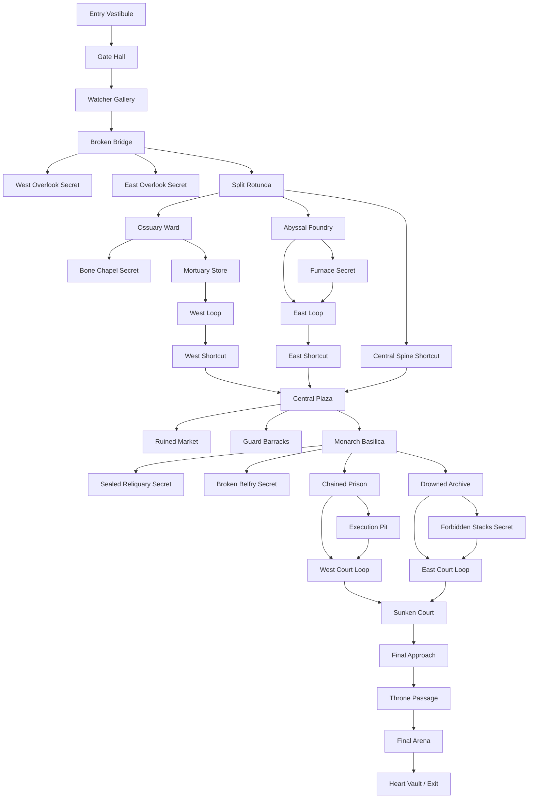

# Master Dungeon Layout

## Measured scope

- Bounds: 173×50×265
- Walkable floor area: 20,774 cells
- Critical-path distance: 848 blocks
- Meaningful spaces: 43
- Major rooms: 13
- Regions: 6
- Distinct floor elevations: 21
- Graph loops: 6
- Unlockable shortcut spaces: 3
- Secret spaces: 7
- Objectives: 9
- Exterior protection: 5 blocks minimum

Compared with the largest old map, the new layout has 4.78× the walkable area and 4.61× the objective-route distance.

## Flow

## Objective sequence

| # | Region/space | Type | Purpose | Checkpoint result |
|---:|---|---|---|---|
| 1 | Broken Bridge | Wave | First large reveal and movement test | Opens west descent |
| 2 | Ossuary Nave | Collection | Slower exploration and sigil recovery | Opens west shortcut |
| 3 | Central Plaza | Wave | Large multi-directional siege | Opens east shortcut/foundry route |
| 4 | Abyssal Foundry | Elite | Cover, columns, and heavy enemies | Opens basilica approach |
| 5 | Monarch Basilica | Collection | Ritual exploration and seal recovery | Opens prison descent |
| 6 | Chained Prison | Elite | Choke points and flanking galleries | Opens court route |
| 7 | Sunken Court | Wave | Large escalation encounter | Opens final approach |
| 8 | Final Arena | Boss | Abyssal Monarch | Opens Heart Vault |
| 9 | Heart Vault | Reward | One-time authoritative reward | Completes session and return flow |

## Region notes

### 1. Gate Descent

- Safe staging room with no enemy spawn.
- Tall Gate Hall and Watcher Gallery establish scale.
- Broken Bridge gives the first long sightline and branching secrets.
- Split Rotunda presents west, east, and central routes.

### 2. Ossuary Ward

- Compressed approach releases into a broad nave.
- Bone Chapel is a reward-bearing dead end.
- Mortuary Store and West Loop reconnect through the first shortcut.
- Lower ceilings contrast with the gate halls.

### 3. Abyssal Foundry

- Industrial columns and heat channels create cover and lateral movement.
- Slag Control and Furnace Secret form a loop.
- East Shortcut returns to the central plaza.

### 4. Buried Kingdom

- Central Plaza is the primary navigation landmark.
- Ruined Market and Guard Barracks provide optional exploration.
- Monarch Basilica is visible as a destination before entry.
- Sealed Reliquary and Broken Belfry reward side exploration and verticality.

### 5. Lower Catacombs

- Prison and archive wings descend independently.
- Both wings contain purposeful loops and reconnect at Sunken Court.
- Chained Prison emphasizes choke points; Drowned Archive emphasizes sightline obstruction.
- Sunken Court is the last large wave arena and convergence point.

### 6. Monarch's Sepulcher

- Final Approach and Throne Passage compress movement and visibility.
- The arena entrance creates a full reveal of the throne landmark.
- Multiple elevations and lateral routes support boss telegraphs and multiplayer.
- Heart Vault provides reward presentation and exit.

## Navigation plan

- Critical route: brighter regular lighting and repeated chiseled frames.
- Optional route: lower light, asymmetric damage, distinct accent props.
- Central Plaza: recurring orientation hub.
- Basilica and throne: apparent destinations visible before arrival.
- Shortcuts: framed doors opened by objective completion.
- Dead ends: seven secrets, each with a landmark or reward purpose.

## Pacing

1. quiet staging
2. monumental reveal
3. first combat
4. compressed exploration
5. central release
6. industrial elite encounter
7. civic exploration
8. ritual escalation
9. paired deep wings
10. convergence battle
11. anticipation corridor
12. boss climax
13. reward and exit
