# Modular Abyssal Necropolis Layout

## Phase 4 flow

```mermaid
flowchart LR
    E[00 Entry] --> D[01 Descent]
    D --> N[02 Outer Necropolis]
    N --> G[03 Guardian Hall]
    G --> C[04 Catacombs]
    C --> B[05 Collapsed Bridge]
    B --> P[06 Prison]
    P --> X[07 Elite Chamber]
    X --> R[08 Ritual Depths]
    R --> A[09 Boss Approach]
    A --> BA[10 Boss Arena]
    BA --> V[11 Reward Vault]
```

The route deliberately alternates arrival, exploration, small combat, traversal, major combat, quieter recovery/secret space, elite pressure, boss buildup, boss, and reward. Catacombs contains the unlockable shortcut; Outer Necropolis, Catacombs, and Elite Chamber contain optional secrets.

## Objective sequence

| # | Module | Encounter purpose | Door result |
|---:|---|---|---|
| 1 | Outer Necropolis | Controlled crypt wave | Opens Guardian route |
| 2 | Guardian Hall | Tank line protecting ranged units | Opens Catacombs |
| 3 | Catacombs | Exploration and tomb groups | Opens Collapsed Bridge |
| 4 | Collapsed Bridge | Movement under ranged pressure | Opens Prison |
| 5 | Prison | Deliberate cell/wave lanes | Opens Elite Chamber |
| 6 | Elite Chamber | Short skill check | Opens Ritual Depths |
| 7 | Ritual Depths | Protected summoner/ritual pressure | Opens Boss Approach |
| 8 | Boss Arena | Abyssal Monarch | Opens Reward Vault |
| 9 | Reward Vault | Exactly-once reward and safe exit | Completes session |

## Navigation and quality rules

- Brighter repeated frames communicate the critical route without a permanent waypoint.
- Optional paths use asymmetric damage, lower light, and distinct accent materials.
- Each module has a primary landmark and four or more authored lights.
- Connector openings remain clear and consistently framed.
- Combat markers have sturdy floors, no liquid, and two-block standing clearance.
- No decoration may overlap a required marker; validation reports the problem instead of erasing authored blocks.
- Binary structure-block exports can replace modules independently while marker positions and catalog dimensions remain stable.

## Current bounds

- Modules: 12
- Combined local bounds: 103x28x336
- Required gameplay markers: 10 plus doors/presentation markers
- Optional secrets: 3
- Unlockable shortcuts: 1
- Arena slot spacing: 224x384
- Placement ceiling: 4,096 changed blocks per server tick

The starter templates establish the workflow and playable composition. Perceived visual quality and route readability remain subject to the mandatory in-game walkthrough recorded in `ACCEPTANCE_TESTS.md`.
